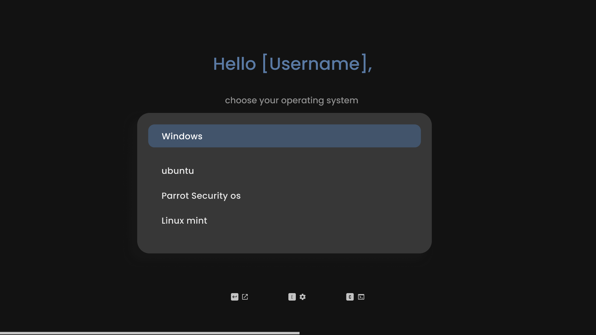
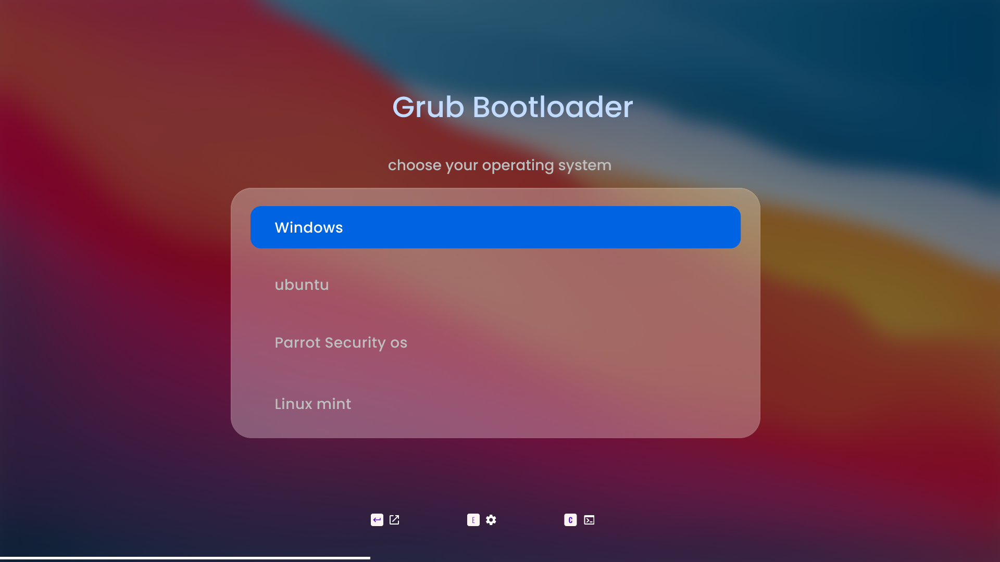
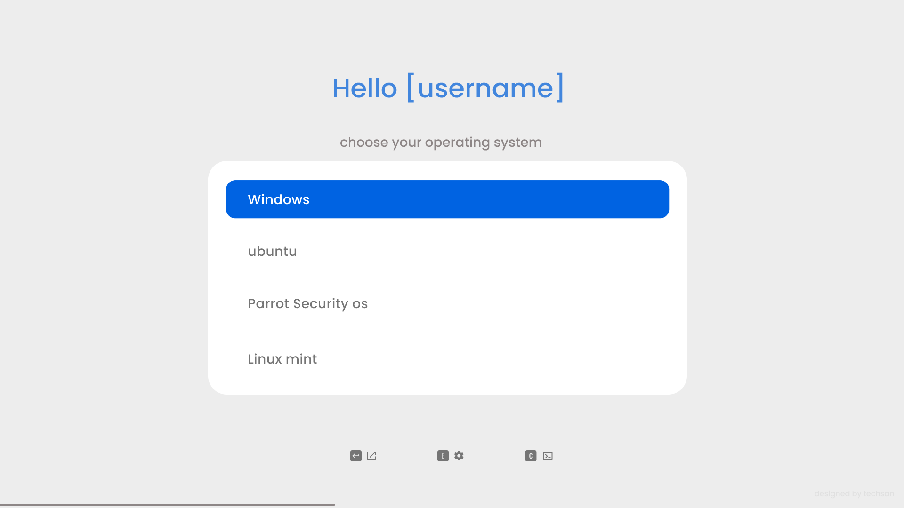
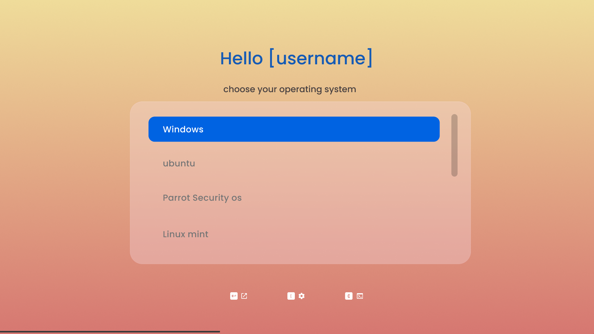

# sleek Grub bootloader themes

My customization of linux begins from theming the grub. Even after trying and using many great grub themes, I was not able to settle on any theme. All of them were great. But, none of them ignite a feeling of, this is the one I am looking for.  Also, I wanted some level of personalization such as my username/name on it. So I myself tried to create one and the result is <strong>sleek grub themes</strong> which is minimal, beautiful and elegent.    &nbsp; &nbsp; &nbsp; &nbsp; Sleek Grub Bootloader Themes has 3 color options "Dark" ,"Light" and "Orange" [I don't know why i choosed this color but it looks beautiful] and one macOs inspired  theme with BigSur wallpaper. If you want to have a feeling of belonging, You can have your name on grub bootloader.
# preview

# Installation
##### Diclaimer: this theme doesnot works with ZFS filesystem
<ul><li>clone this repository</li><li>cd into respective theme (dark/light/orange/bigsur)</li> <li>execute install.sh script included with it as super user ( sudo ./install.sh )</li>
</ul>

# License
<ul><li>MIT</li><ul>

